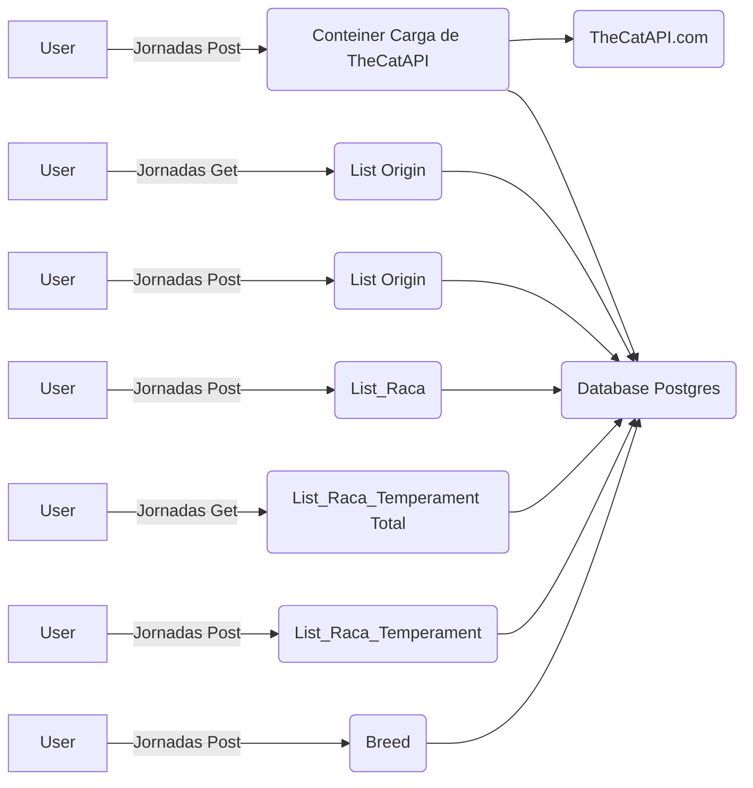



**Fluxos (Jornadas) de consumo das API**

**Primero processo realizaria teste unitários para todas as API utilizando** 
 - Unit Teste para os processo validando em **sonarqube** e   Teste de contrato como
 -    [playwriting](https://docs.pactflow.io/docs/bi-directional-contract-testing/)

**Teste de carga usando as metodologias** 
 - **Carga funcional** para identificar o consumo da aplicação para um processo ou uma jornada única.
 - **Carga de Saturação** ou de Capacidade para identificar os ponto de capacidade ou saturação ou definição de BASELINE e threshold para  minha aplicação. 
 - E por ultimo **Stress** para validar todo o ambiente
   ou ate mesmo caos test do ambiente e validação de monitoramento
   capacidade e resiliência da aplicação.

***O importante para a realização de teste processo e que todo o ambiente esteja monitorado, ELK , Dynatrace, NewRelic , Datadog, App Dynamic , etc..*** 