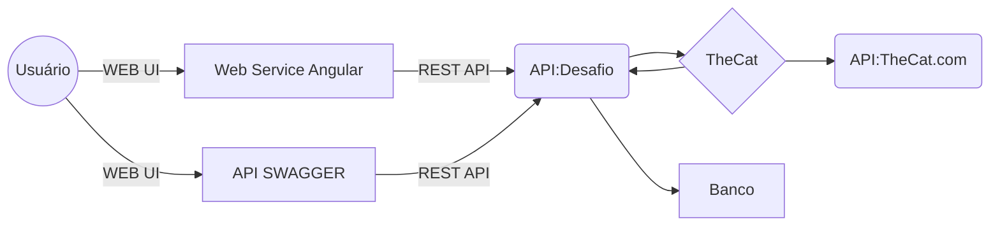

# TheCatAPI

Case para teste conhecimentos, onde será realizado procedimento de consulta de uma API e tratativa de dados e armazenamento em um banco de dados utilizando as seguinte tecnologias 

 - C# com estrutura de consumo de API e ao mesmo tempo serviços RESTFULL
   para distribuição e consulta dos dados. estruturação da API em Swagger.
 - Banco de dados em PostgreSQL em Docker.
 - Recurso de visual de dados estaremos utilizando Pgadmin.

## Fluxo de Funcionamento

|Configurações| Links |
|--|--|
| **API**  | [Git Fontes](https://github.com/peringfc/TheCatAPI)  |
| **DLL**  | [Git Fontes](https://github.com/peringfc/TheCatAPI_Lib)  |
|**Angular** | [Git Fontes](https://github.com/peringfc/TheCatAPIAngular)  |
| Print **Angular**  | [Git Fontes](https://github.com/peringfc/TheCatAPI_Lib/blob/master/Documents/Imagens/angular_01.png)  |
| **Documentação** | [Git Fontes](https://github.com/peringfc/TheCatAPI_Lib/tree/master/Documents)  |
|**Printers de Telas** | [Git Printers](https://github.com/peringfc/TheCatAPI_Lib/tree/master/Documents/Imagens)  |
| Print **API**  | [Git Fontes](https://github.com/peringfc/TheCatAPI_Lib/blob/master/Documents/Imagens/API_003_json.png)  |
| **PostMan**  | [Git Fontes](https://github.com/peringfc/TheCatAPI_Lib/tree/master/Documents/Postman)  |
| **Docker Compose  Ambiente** | [Git Fontes](https://github.com/peringfc/TheCatAPI_Lib/blob/master/Documents/DockerComposer.md)  |
