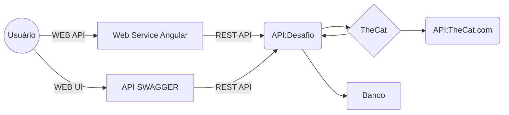

# TheCatAPI

Case para teste conhecimentos, onde será realizado procedimento de consulta de uma API e tratativa de dados e armazenamento em um banco de dados utilizando as seguinte tecnologias 

 - C# com estrutura de consumo de API e ao mesmo tempo serviços RESTFULL
   para distribuição e consulta dos dados. estruturação da API em Swagger.
 - Banco de dados em PostgreSQL em Docker.
 - Recurso de visual de dados estaremos utilizando Pgadmin.

## Fluxo de Funcionamento

